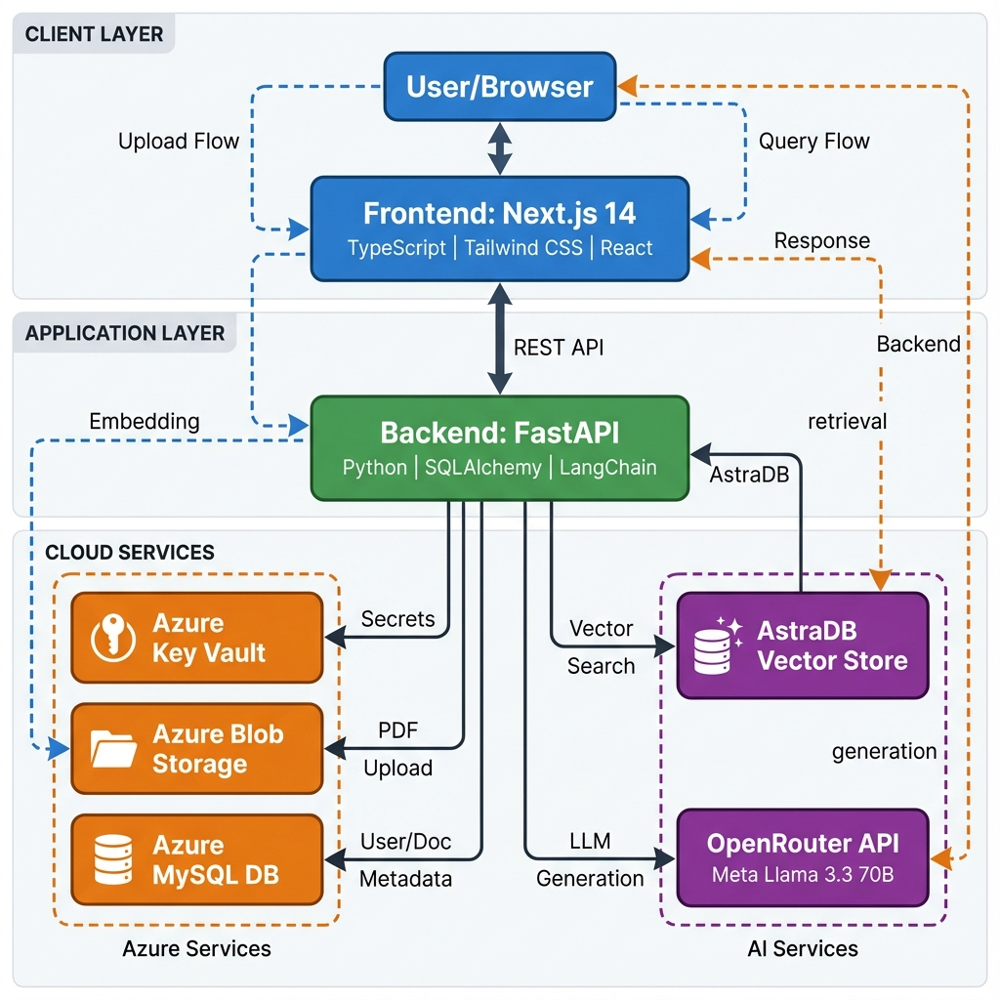

# Fullstack RAG Application

Here is the architecture of the project:


A powerful full-stack application enabling users to upload PDF documents and perform Retrieval-Augmented Generation (RAG) queries against them. This project leverages the power of **Next.js** for the frontend, **FastAPI** for the backend, **AstraDB** for vector storage, and **Meta Llama 3.3** (via OpenRouter) for high-quality AI responses.

## 🚀 Features

*   **📄 Document Management**: Securely upload and manage PDF documents using Azure Blob Storage.
*   **🔍 Vector Search**: Efficient similarity search powered by **AstraDB** and **FastEmbed** embeddings.
*   **🧠 Advanced RAG**: Implements sophisticated retrieval strategies:
    *   **Multi-Query Retrieval**: Generates multiple perspectives of a query to find relevant context.
    *   **Contextual Compression**: Compresses retrieved documents to extract only the most relevant information.
*   **🤖 State-of-the-Art LLM**: Integrates **Meta Llama 3.3 70B** via OpenRouter for accurate and context-aware answers.
*   **🔐 Secure Authentication**: User authentication and authorization.
*   **☁️ Cloud Native**: Built with Azure integration for secrets management (KeyVault) and storage.
*   **🎨 Modern UI**: Responsive and accessible interface built with **Next.js 14**, **Tailwind CSS**, and **Radix UI**.

## 🛠️ Tech Stack

### Frontend
*   **Framework**: [Next.js 14](https://nextjs.org/)
*   **Language**: TypeScript
*   **Styling**: [Tailwind CSS](https://tailwindcss.com/)
*   **UI Components**: [Radix UI](https://www.radix-ui.com/), [Lucide React](https://lucide.dev/)
*   **HTTP Client**: Axios

### Backend
*   **Framework**: [FastAPI](https://fastapi.tiangolo.com/)
*   **Language**: Python 3.10+
*   **ORM**: SQLAlchemy
*   **AI/RAG**: [LangChain](https://www.langchain.com/), [AstraPy](https://github.com/datastax/astrapy)
*   **Embeddings**: FastEmbed (BAAI/bge-small-en-v1.5)
*   **PDF Processing**: PyPDF

### Infrastructure & Services
*   **Vector Database**: [DataStax AstraDB](https://www.datastax.com/products/datastax-astra)
*   **Relational Database**: MySQL (Azure Database for MySQL)
*   **Cloud Storage**: Azure Blob Storage
*   **Secrets Management**: Azure Key Vault
*   **LLM Provider**: [OpenRouter](https://openrouter.ai/)

## 📋 Prerequisites

Before you begin, ensure you have the following:

*   **Node.js** (v18 or higher) & **npm**
*   **Python** (v3.10 or higher)
*   **Azure Account** with:
    *   Azure Key Vault
    *   Azure Blob Storage
    *   Azure Database for MySQL (or a local MySQL instance)
*   **AstraDB Account** (Serverless Vector DB)
*   **OpenRouter API Key**

## ⚙️ Installation & Setup

### 1. Clone the Repository

```bash
git clone <repository-url>
cd fullstackRAG
```

### 2. Backend Setup (`api/`)

Navigate to the API directory:

```bash
cd api
```

Create and activate a virtual environment:

```bash
# Windows
python -m venv venv
.\venv\Scripts\activate

# macOS/Linux
python3 -m venv venv
source venv/bin/activate
```

Install dependencies:

```bash
pip install -r requirements.txt
```

**Environment Configuration:**

Create a `.env` file in the `api` directory with the following Azure credentials (used to fetch other secrets from Key Vault):

```env
AZURE_CLIENT_ID=<your-azure-client-id>
AZURE_TENANT_ID=<your-azure-tenant-id>
AZURE_CLIENT_SECRET=<your-azure-client-secret>
AZURE_VAULT_URL=<your-key-vault-url>
AZURE_STORAGE_URL=<your-blob-storage-url>
```

**Key Vault Secrets:**

Ensure your Azure Key Vault contains the following secrets:
*   `astradbendpoint`: Your AstraDB API Endpoint.
*   `astratoken`: Your AstraDB Application Token.
*   `openrouterapikey`: Your OpenRouter API Key.
*   `mysqluser`: MySQL username.
*   `mysqlpassword`: MySQL password.
*   `dbhost`: MySQL host address.

Run the backend server:

```bash
uvicorn main:app --reload
```
The API will be available at `http://localhost:8000`.

### 3. Frontend Setup (`frontend/`)

Navigate to the frontend directory:

```bash
cd ../frontend
```

Install dependencies:

```bash
npm install
```

**Environment Configuration:**

Create a `.env.local` file in the `frontend` directory:

```env
NEXT_PUBLIC_API_URL=http://localhost:8000
```

Run the development server:

```bash
npm run dev
```
The application will be available at `http://localhost:3000`.

## 📂 Project Structure

```
fullstackRAG/
├── api/                 # FastAPI Backend
│   ├── routers/         # API Routes (auth, document)
│   ├── azure_utils.py   # Azure integration utilities
│   ├── database.py      # Database connection setup
│   ├── main.py          # Application entry point
│   ├── models.py        # SQLAlchemy models
│   ├── rag.py           # RAG pipeline implementation
│   └── requirements.txt # Python dependencies
├── frontend/            # Next.js Frontend
│   ├── src/
│   │   ├── app/         # Next.js App Router pages
│   │   ├── components/  # React components
│   │   └── lib/         # Utility functions
│   ├── public/          # Static assets
│   └── package.json     # Node.js dependencies
└── README.md            # Project Documentation
```
